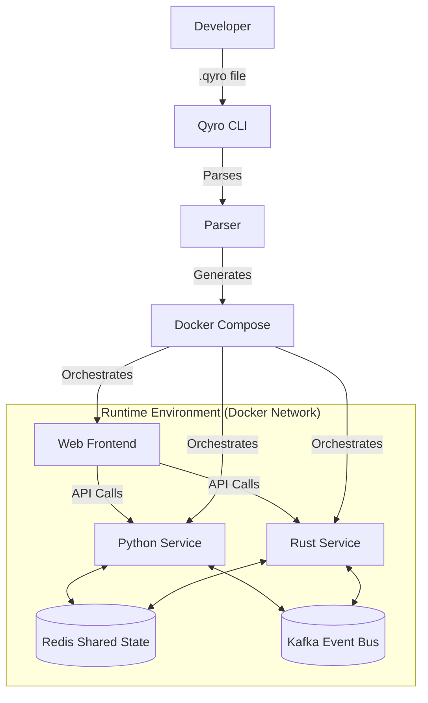

# Qyro 1.0.0 🌀

**The Universal Polyglot Runtime for SaaS**

[](https://badge.fury.io/py/qyro)
[](https://opensource.org/licenses/MIT)
[]()
[]()

> **Build distributed systems in a single file.** 
> Qyro orchestrates Python, Rust, Java, Go, C++, and Node.js components using Docker, with shared state and event streaming built-in.

---

## 🏗 Architecture



---

## 🚀 Key Features

*   **📝 Single-File Logic**: Define your entire stack (frontend, backend, workers) in one `.qyro` file.
*   **🌍 True Polyglot**: First-class support for **Python, Rust, Java, Go, C/C++, and Node.js**.
*   **🔗 Cross-Language RPC**: Call functions across languages as if they were local.
    ```python
    # Python calling Rust
    result = qyro.call("rust-service.process_data", data)
    ```
*   **💾 Distributed State**: Built-in primitives for shared memory (`qyro.get/set`) backed by Redis.
*   **📡 Event Streaming**: Built-in Pub/Sub (`qyro.publish/subscribe`) backed by Kafka.
*   **🔥 Hot Reload**: Modify your `.qyro` file and see changes instantly with `qyro run --watch`.
*   **⚡ Production Ready**: Multi-stage builds (`--prod`), image caching, and circuit breakers.
*   **💻 Developer Experience**: Beautiful CLI logs, VS Code extension, and automatic port management.

---

## 📦 Installation

```bash
pip install qyro
```

**Prerequisites:**
*   **Docker Desktop** (Must be running)
*   **Python 3.9+**

---

## ⚡ Quick Start

### 1. Initialize a Project
```bash
qyro init myapp
cd myapp
```

### 2. Define Your Architecture (`myapp.qyro`)
```python
>>>web:frontend [react, axios]
import React, { useEffect, useState } from 'react';
import { call } from './qyro_adapters/js_adapter';

export default function App() {
  const [msg, setMsg] = useState("Loading...");
  
  useEffect(() => {
    // Call Python function from React
    call("api.hello", "World").then(setMsg);
  }, []);
  
  return <h1>{msg}</h1>;
}

>>>python:api [fastapi]
from qyro_adapters.python_adapter import expose

@expose
def hello(name: str):
    return f"Hello {name} from Python 🐍"
```

### 3. Run It
```bash
qyro run myapp.qyro --watch
```
Qyro will compile your code into Docker containers, set up networking, start Redis/Kafka, and launch your app.

---

## 📚 Language Support

Qyro injects language-specific adapters into every container, giving you a unified API.

### 🐍 Python
**Header**: `>>>python:name [pip-packages]`
```python
from qyro_adapters.python_adapter import expose, call, get, set

@expose
def add(a: int, b: int) -> int:
    return a + b
```

### 🦀 Rust
**Header**: `>>>rust:name [crate-dependencies]`
```rust
use qyro_adapters::Qyro;

Qyro::expose("add", |args| {
    // ... implementation
});
```

### ☕ Java
**Header**: `>>>java:name [maven-dependencies]`
```java
import com.qyro.adapters.Qyro;

Qyro.expose("add", args -> {
    return args.get(0) + args.get(1);
});
```

### 🐹 Go
**Header**: `>>>go:name [go-modules]`
```go
import "qyro/adapters"

adapters.Expose("add", func(args []interface{}) interface{} {
    return args[0].(int) + args[1].(int)
})
```

### 🕸️ Web (React/Next.js)
**Header**: `>>>web:name [npm-packages]`
```javascript
import { call } from './qyro_adapters/js_adapter';

await call("service.function", args);
```

---

## 🛠 Advanced Usage

### Hot Reloading
Watch for file changes and auto-restart services:
```bash
qyro run myapp.qyro --watch
```

### Production Builds
Create optimized, multi-stage Docker images for deployment:
```bash
qyro build myapp.qyro --prod
```

### Manual Build Control
Force a rebuild without using cache:
```bash
qyro build --no-cache
```

---

## 💻 VS Code Extension

For the best experience, use the **Qyro VS Code Extension**.

1.  Navigate to `vscode_extension/` in the repo.
2.  Install dependencies: `npm install`
3.  Package: `vsce package`
4.  Install `.vsix` in VS Code.

**Features:**
*   Syntax highlighting for mixed languages embedded in `.qyro`.
*   Snippets for quick service generation (`>>>python`, `>>>rust`, etc.).
*   Intellisense for Qyro headers.

---

## 📄 License

MIT © 2024 Qyro Team

<p align="center">
  Generated with ❤️ by Antigravity
</p>
