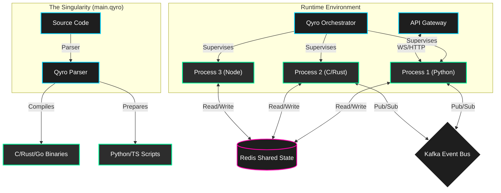

<div align="center">
  

  <p align="center">
    <b>The Universal Polyglot Runtime</b>
    <br>
    Write Python, C, Rust, Go, Java, and TypeScript in a <i>single file</i> with shared state and event streams.
  </p>

  [](https://opensource.org/licenses/MIT)
  [](https://www.python.org/downloads/)
  [](https://redis.io/)
  [](https://kafka.apache.org/)
  []()
</div>

---

<div align="center">
  
</div>

---

## 🚀 The Singularity for Code

**Qyro** breaks down language barriers. It allows you to define an entire distributed system—backend logic, high-performance kernels, and frontend UI—in a single `.qyro` file.

The **Qyro Orchestrator** parses this file, compiles native code (C/Rust/Go) on the fly, launches microservices, and connects them via a high-speed **Shared Memory Event Bus** (Redis) and **Reliable Event Streaming** (Kafka).

### ✨ Key Features

| Feature | Description |
|---------|-------------|
| **🏳️‍🌈 Polyglot** | Mix Python, C, Rust, Go, Java, TypeScript, and React in one file. |
| **🧠 Shared State** | Zero-latency variable sharing across languages via Redis. |
| **📡 Event Driven** | Built-in Kafka integration for reliable, scalable messaging. |
| **🛡️ Self-Healing** | Automatic process supervision, crash detection, and exponential backoff. |
| **⚡ High Performance** | Compile native modules on-the-fly for critical paths. |
| **🌐 API Gateway** | Integrated WebSocket/HTTP gateway for external access. |

---

## 🏗️ Architecture

Qyro isn't just a runner; it's a complete operating environment.



---

## ⚡ Quick Start

### Prerequisites
*   Python 3.8+
*   Redis (Optional, for shared state)
*   Kafka (Optional, for event streaming)

### Installation

```bash
git clone https://github.com/qyro-dev/qyro.git
cd qyro
pip install -r requirements.txt
```

### Running Your First App

Create a file named `hello.qyro`:

```python
>>>schema:global
# Define shared state variables
counter: int

>>>python:p1
import time
from qyro.lib import shared
print("Python: Starting counter...")
while True:
    val = shared.get("counter") or 0
    shared.set("counter", val + 1)
    time.sleep(1)

>>>c:p2
#include <stdio.h>
// C code runs natively!
int main() {
    printf("C Module: Watching shared memory...\n");
    while(1) {
        // Pseudo-code for brevity
        sleep(1);
    }
    return 0;
}
```

Run it:

```bash
python run.py hello.qyro
```

---

## 📚 Documentation

Detailed documentation is available in the [Wiki](https://github.com/qyro-dev/qyro/wiki).

*   [Language Reference](https://github.com/qyro-dev/qyro/wiki/Language-Reference)
*   [API Guide](https://github.com/qyro-dev/qyro/wiki/API-Guide)
*   [Deployment](https://github.com/qyro-dev/qyro/wiki/Deployment)

---

<div align="center">
  <sub>Built with ❤️ by the Qyro Team. Code simpler. Build faster. Scale infinitely.</sub>
</div>
